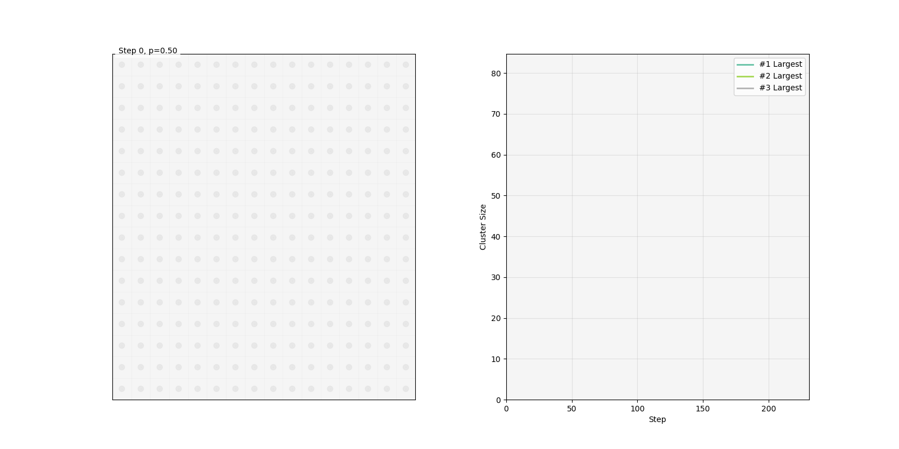

# simulate bond percolation

a union-find / path compression percolation simulation in zig with `matplotlib` visualization




> [!NOTE]
> inspired by the work of [Dr. Robert M. Ziff](https://scholar.google.com/citations?hl=en&user=CUqzFcEAAAAJ)

## requirements
- [zig](https://ziglang.org/learn/getting-started/#managers)
- [uv](https://docs.astral.sh/uv/getting-started/installation/)

```
git clone https://github.com/zzstoatzz/percolation
cd percolation
```

## Usage

The simplest way to run the simulation is using the provided `run` script:

```bash
# Run with default parameters
chmod +x run
./run

# Run with custom simulation parameters
GRID_SIZE=20 P=0.6 SEED=42 ./run

# Save animation to a file
ANI_SAVE=animation.gif ./run
```

the gif above was generated with:
```
ANI_SAVE=animation.gif GRID_SIZE=10 ./run
```


You can also run the steps manually:

```bash
# Build
zig build

# Run simulation with custom parameters
GRID_SIZE=20 P=0.6 SEED=42 ./zig-out/bin/percolation

# Visualize (with optional animation parameters)
uv run read.py --save animation.gif --interval 100 --dpi 150
```

## Configuration

The simulation can be controlled via environment variables:

```bash
# Simulation parameters
GRID_SIZE=20    # Grid size (default: 10)
P=0.6           # Bond probability (default: 0.5) 
SEED=42         # Random seed (default: current timestamp)

# Animation parameters
ANI_SAVE=""     # Path to save animation (e.g. "animation.gif")
ANI_INTERVAL=50 # Animation speed in milliseconds (default: 50)
ANI_DPI=100     # DPI for saved animation (default: 100)
```